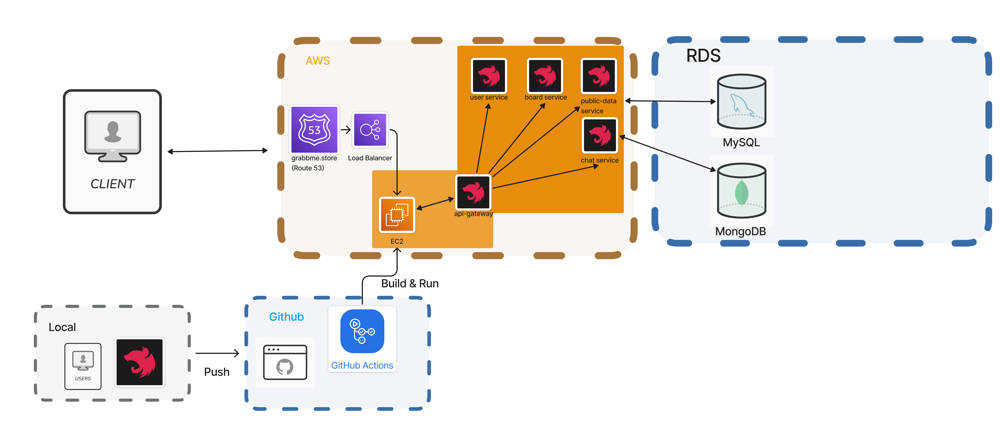

<h1>GrabbMe 프로젝트 Backend</h1>

<h3>1. 프로젝트 소개</h3>

사이드 프로젝트를 모집 및 참여를 희망하는 개발자, IT 직군의 희망자들을 위해 
자신의 사이드 프로젝트 아이디어를 공유하여 팀원을 모을 수도 있고,  
관심가는 아이디어의 사이드 프로젝트도 자유롭게 참여할 수 있는 커뮤니티형 플랫폼 입니다.

<h3>2. 기술 스택</h3>

  
  
  
   
  
  
  
  
   
  
  
  
  
   
  
  
  

<h3>3. 서버 전체 구조</h3>

<h3>4. 기술 의사 결정</h3>
<table>
  <thead>
    <tr>
      <th>사용기술</th>
      <th>의사 결정</th>
    </tr>
  </thead>
  <tbody>
    <tr>
      <td>Nest.js Monorepo + Api-Gateway</td>
      <td>
      우선적으로 코드 베이스의 일관성을 유지하기 위해 채택
      재사용 모듈 또는 공통된 데이터 모듈으 사용에 있어서 Multi Module을 통해
      공용성을 띈 모듈의 의존성을 각 마이크로 서비스에 주입할 수 있어 사용했으며,
      요청에 대한 분배 처리, 비즈니스 로직과 외부노출 Endpoint의 책임 분리를 통해 개발환경 일관성을 위해 Gateway 패턴을 적용
      </td>
    </tr>
    <tr>
      <td>Passport</td>
      <td>
        소셜로그인 지원을 위한 인증 프로세스 관리를 위해 사용 
        안정성 및 활용도가 검증되었으며, 현재 사용중인 Github 인증 로그인을 제외한
        다른 소셜 로그인 적용시에도 용이하므로 적용
      </td>
    </tr>
    <tr>
      <td>채팅 MongoDB</td>
      <td>
      평균 읽기속도 5~10ms, 쓰기 속도 50~150ms 의 속도로인해, 채팅 서비스의 성격상
      데이터의 빠른 입출력을 위해 채택하였으며, 비정형 데이터인 채팅에 관한 데이터를 저장하기 위한
      NoSQL 형태의 DB 사용을 위해 사용
      </td>
    </tr>
    <tr>
      <td>포스팅 MySQL</td>
      <td>
      ACID 트랜잭션 지원으로 인한, 작업 수행에 대한 일관성을 유지할 수 있으며
      포스팅에 대한 작성자, 북마크, 지원자와의 관계형 데이터 CRUD를 위해 사용
      </td>
    </tr>
    <tr>
      <td>JWT</td>
      <td>
      서버의 상태정보를 저장하지 않는 Stateless 기반 인증/인가 프로세스를 위해 사용하였으며
      특히 서명을 통해 서버 발급 토큰에 대한 검사를 자체적으로 수행 하여 보안성 강화를 위해 사용하였습니다.
      </td>
    </tr>
  </tbody>
</table>
